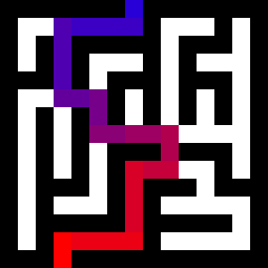

# maze-transform

Inspired by a particular Computerphile video. Generates mazes (2d
array of booleans) and solves them by converting into a compact
graph and running textbook algorithms. Usage:

    # make a 100x50 maze
    $ ./maze 100 50 file.png
